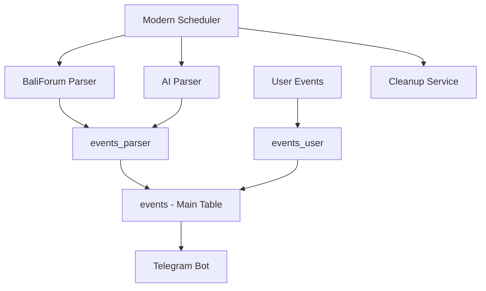

# 🤖 Event-Bot with Full Automation System

[](https://github.com/yourusername/event-bot/actions)
[](https://www.python.org/downloads/)
[](https://github.com/astral-sh/ruff)

> 🎯 **Telegram бот для поиска событий с полной автоматизацией парсинга**

## ✨ Основные возможности

### 🤖 **Telegram Bot**
- 🔍 Поиск событий по координатам и радиусу
- 🌍 Поддержка городов: Бали, Москва, СПб
- 👥 Создание пользовательских событий
- 📊 Статистика и аналитика

### 🚀 **Автоматизация (NEW!)**
- ⏰ **Парсинг каждые 12 часов** (утром и вечером)
- 🧹 **Автоочистка** старых событий каждые 6 часов
- 📊 **Правильная архитектура**: events_parser → events
- 🌴 **BaliForum парсер** - реальные события с baliforum.ru
- 🤖 **AI парсер** - умная генерация событий

## 🏗️ Архитектура



### 📊 **Правильная архитектура данных:**
1. **Парсеры** сохраняют в `events_parser`
2. **Пользователи** создают в `events_user`
3. **Автосинхронизация** в основную таблицу `events`
4. **Бот читает** из единой таблицы `events`

## 🚀 Быстрый старт

### 1. Клонирование
```bash
git clone https://github.com/yourusername/event-bot.git
cd event-bot
```

### 2. Установка зависимостей
```bash
pip install -r requirements.txt
```

### 3. Настройка переменных
```bash
cp env.local.template .env
# Отредактируйте .env файл
```

### 4. Запуск
```bash
# Локальная разработка
python bot_enhanced_v3.py

# Продакшн с автоматизацией
python start_production.py

# Настройка автоматизации
python setup_automation.py
```

## 🌐 Деплой

### 🚂 Railway (Рекомендуется)
```bash
# Быстрый деплой
python deploy.py

# Или вручную
railway up
```

### 🔧 Heroku
```bash
git push heroku main
```

### 📋 Переменные окружения
```env
# Обязательные
DATABASE_URL=postgresql://...
TELEGRAM_TOKEN=your_bot_token
OPENAI_API_KEY=your_openai_key

# Опциональные
GOOGLE_MAPS_API_KEY=your_maps_key
ENABLE_BALIFORUM=1
AI_PARSE_ENABLE=1
```

## ⏰ Расписание автоматизации

| Время | Действие | Описание |
|-------|----------|----------|
| 🌅 ~08:00 | Утренний парсинг | Свежие события на день |
| 🌙 ~20:00 | Вечерний парсинг | События на завтра |
| 🧹 Каждые 6ч | Очистка | Удаление старых событий |

## 📊 Статистика

- ✅ **Архитектура исправлена** - правильный поток данных
- 🎯 **Оптимизировано** - парсинг 2 раза в день (вместо каждые 30 мин)
- 💰 **Экономично** - минимум API вызовов
- 🌐 **Вежливо** - не перегружаем источники

## 🛠️ Разработка

### Структура проекта
```
event-bot/
├── 🤖 bot_enhanced_v3.py      # Основной бот
├── 🚀 modern_scheduler.py     # Автоматизация
├── 🎯 start_production.py     # Продакшн запуск
├── 📊 utils/                  # Утилиты
│   ├── unified_events_service.py
│   └── geo_utils.py
├── 🌴 sources/                # Парсеры
│   ├── baliforum.py
│   └── kudago_source.py
└── 📋 DEPLOY_WITH_AUTOMATION.md
```

### Тестирование
```bash
# Проверка парсера
python run_baliforum_ingest.py

# Тест автоматизации
python modern_scheduler.py

# Проверка архитектуры
python -c "from utils.unified_events_service import UnifiedEventsService; print('✅ OK')"
```

## 📈 Мониторинг

### Railway
```bash
railway logs              # Логи приложения
railway status            # Статус сервиса
railway connect           # Подключение к БД
```

### Проверка здоровья
```bash
curl https://your-app.railway.app/health
curl https://your-app.railway.app/api/events/stats
```

## 🎯 Roadmap

- [x] ✅ Исправление архитектуры парсинга
- [x] ✅ Автоматизация каждые 12 часов
- [x] ✅ Правильная синхронизация данных
- [x] ✅ Автоочистка старых событий
- [ ] 🔄 Facebook Events парсер
- [ ] 🔄 Instagram события
- [ ] 🔄 Telegram каналы парсинг
- [ ] 🔄 Веб-интерфейс для админки

## 🤝 Contributing

1. Fork the repository
2. Create feature branch: `git checkout -b feature/amazing-feature`
3. Commit changes: `git commit -m 'Add amazing feature'`
4. Push to branch: `git push origin feature/amazing-feature`
5. Open Pull Request

## 📝 License

MIT License - see [LICENSE](LICENSE) file

## 🙏 Благодарности

- 🌴 [BaliForum](https://baliforum.ru) - источник событий
- 🤖 OpenAI - AI парсинг событий
- 🚂 Railway - хостинг платформа
- 🐍 Python - лучший язык для ботов!

---

**Made with ❤️ for event discovery automation**

> 🎯 Perfect architecture + 🚀 Smart automation = 💎 Production ready!
